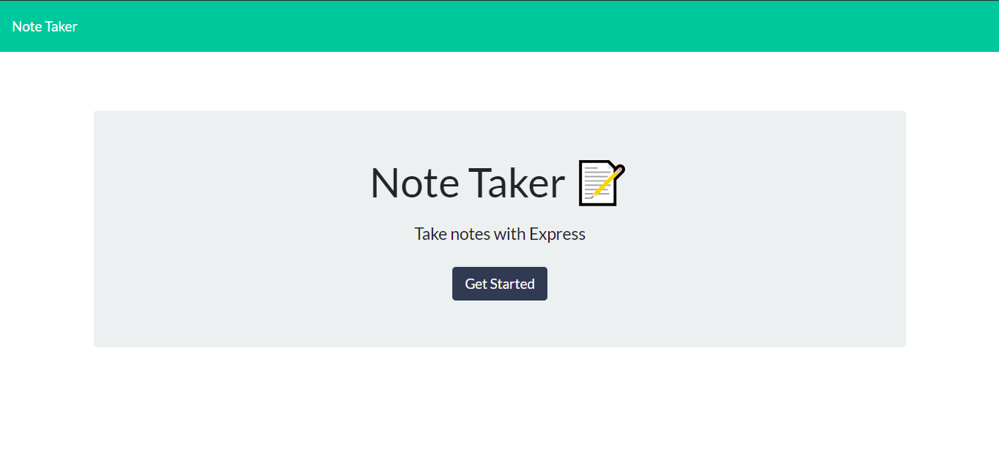
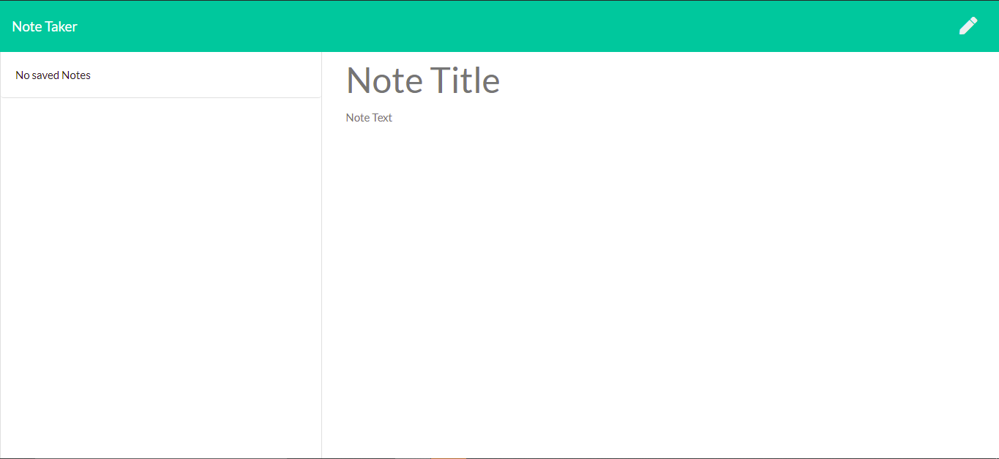
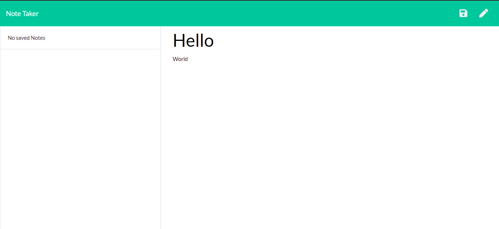
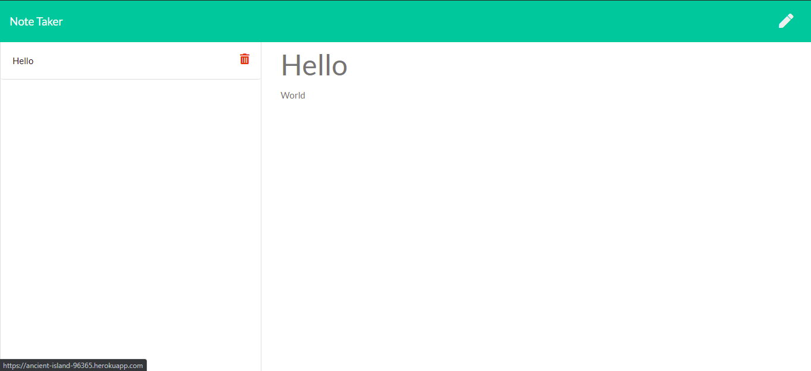
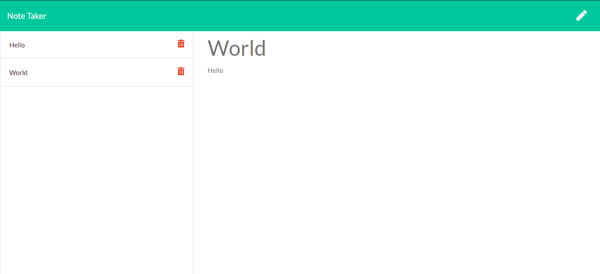
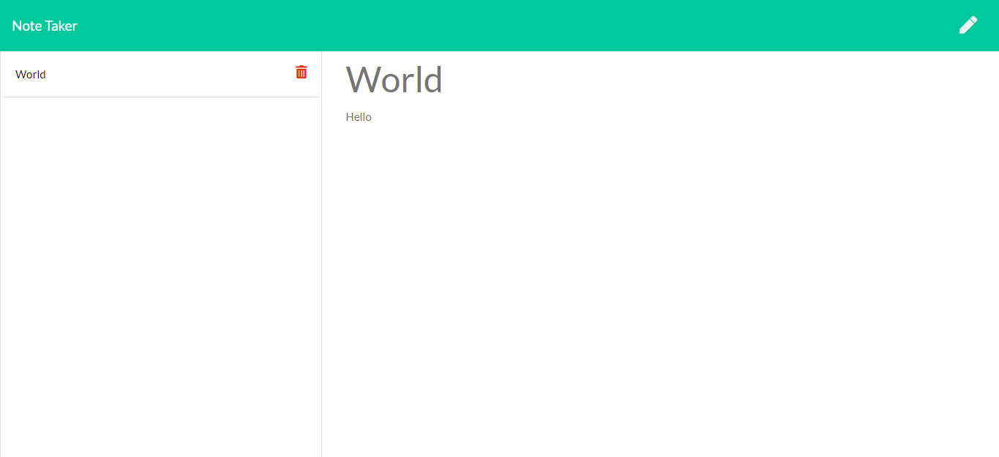

# Note Taker

## Table of Contents
- [Description](#description)
- [Features](#features)
- [Technology Used](#technology-used)
- [Future Features](#future-features)
- [Authors](#authors)

## Description
Note taker is a web application that allows the user to write and save notes with a subject. Once a note's use has expired, the user can delete the note. The application uses Bootstrap for the styling and Font Awesome for the icons to compliment the styling. Node.js and Express.js are used for the backend server along with the backend API then the frontend uses JavaScript and jQuery to use the API.

## Features
- Landing page before seeing the appplication.

- Main page of the application where the side-bar on the left shows if there were notes made previously.

- The user can type a subject along with a body and then save the note by clicking the floppy disk icon in the top right corner.

- This is what the note shows up as once it is saved. A new note can be composed by clicking the pencil icon in the top right corner.

- Two notes are saved in the image below and the second note that was saved is being displayed.

- One of the notes was deleted by clicking on the red trash icon and now only the second note that was created is being displayed.

## Technology Used
- HTML
- CSS
- Bootstrap
- Font Awesome
- JavaScript
- jQuery
- Node.js
- Express.js

## Future Features
- Allow the user to edit the body and subject of previously made notes.

## Authors
- Jack Ceballos